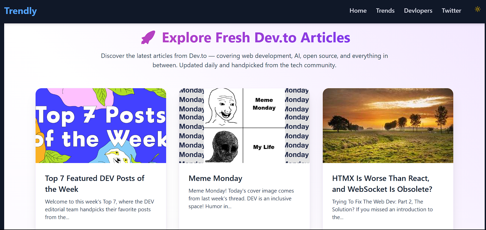
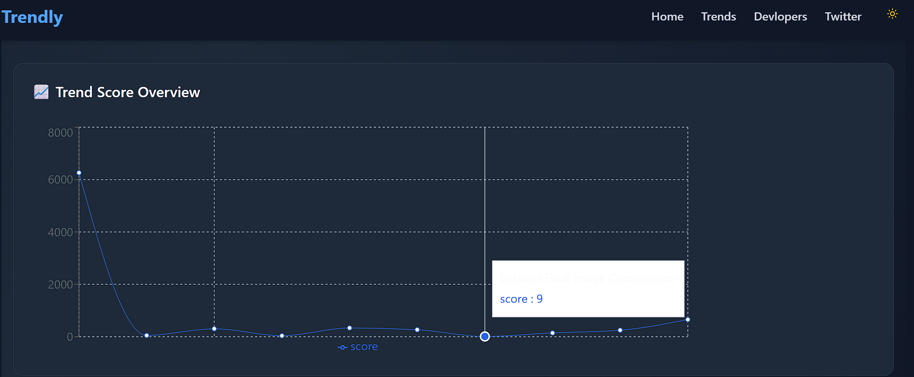
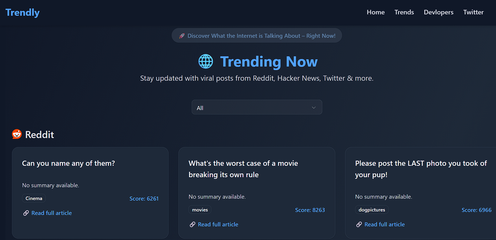
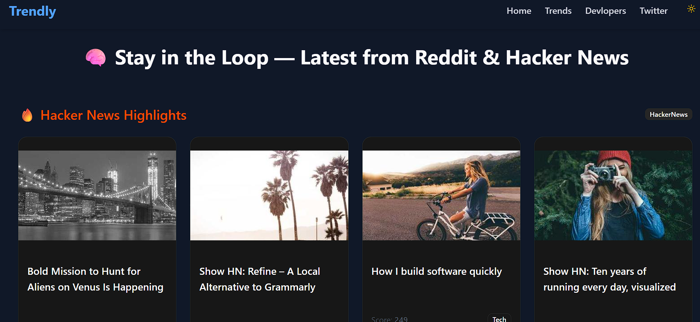

# trendly
=======
# 🧠 Trendly

Trendly is a full-stack web application that fetches and displays trending posts from sources like **Reddit** and **Hacker News** in a clean, visually engaging UI.

---

## 📁 Project Structure
trendly/
 backend/ 
 frontend/
 README.md 


---

## 📸 Screenshots

### 🏠 Home Page


---

### 📈 Trends Page (with filters)



---

### 📊 Trend Score Chart



---

### 🔍 Filtered by Reddit



---

### 🔍 Filtered by Hacker News



---

## 🚀 Features

- 🔥 Fetches trending posts from Reddit and Hacker News
- 💾 Stores trends in MongoDB
- 📊 Displays posts and charts in a modern UI
- 🗂 Filter by source (Reddit, Hacker News, etc.)
- 📈 Line chart for trend scores

---

## 🧩 Tech Stack

| Layer      | Stack                            |
|------------|----------------------------------|
| Frontend   | React (with Tailwind, Recharts)  |
| Backend    | Node.js + Express                |
| Database   | MongoDB (via Mongoose)           |

---

## 🔧 Setup

### 1. Clone the Repo

```bash
git clone https://github.com/your-username/trendly.git
cd trendly


---

## 🚀 Features

- 🔥 Fetches trending posts from Reddit and Hacker News
- 💾 Stores trends in MongoDB
- 📊 Displays posts and charts in a modern UI
- 🗂 Filter by source (Reddit, Hacker News, etc.)
- 📈 Line chart for trend scores

---

## 🧩 Tech Stack

| Layer      | Stack                            |
|------------|----------------------------------|
| Frontend   | React (with Tailwind, Recharts)  |
| Backend    | Node.js + Express                |
| Database   | MongoDB (via Mongoose)           |

---

## 🔧 Setup

### 1. Clone the Repo

```bash
git clone https://github.com/your-username/trendly.git
cd trendly

cd backend
npm install
cp .env.example .env   # Add your MongoDB URI
npm start              # or npm run dev (if using nodemon)

| Method | Route               | Description                 |
| ------ | ------------------- | --------------------------- |
| `GET`  | `/api/trends`       | Get stored trends           |
| `POST` | `/api/fetch-trends` | Fetch and store latest data |


cd frontend
npm install
npm run dev   # or npm run start

## 📸 Screenshots

### 🏠 Home Page


### 📈 Trends Page


Built with ❤️ by Nitish Kumar


>>>>>>> 816a03f4251db01caad3b71cf0dca45dc1654175
